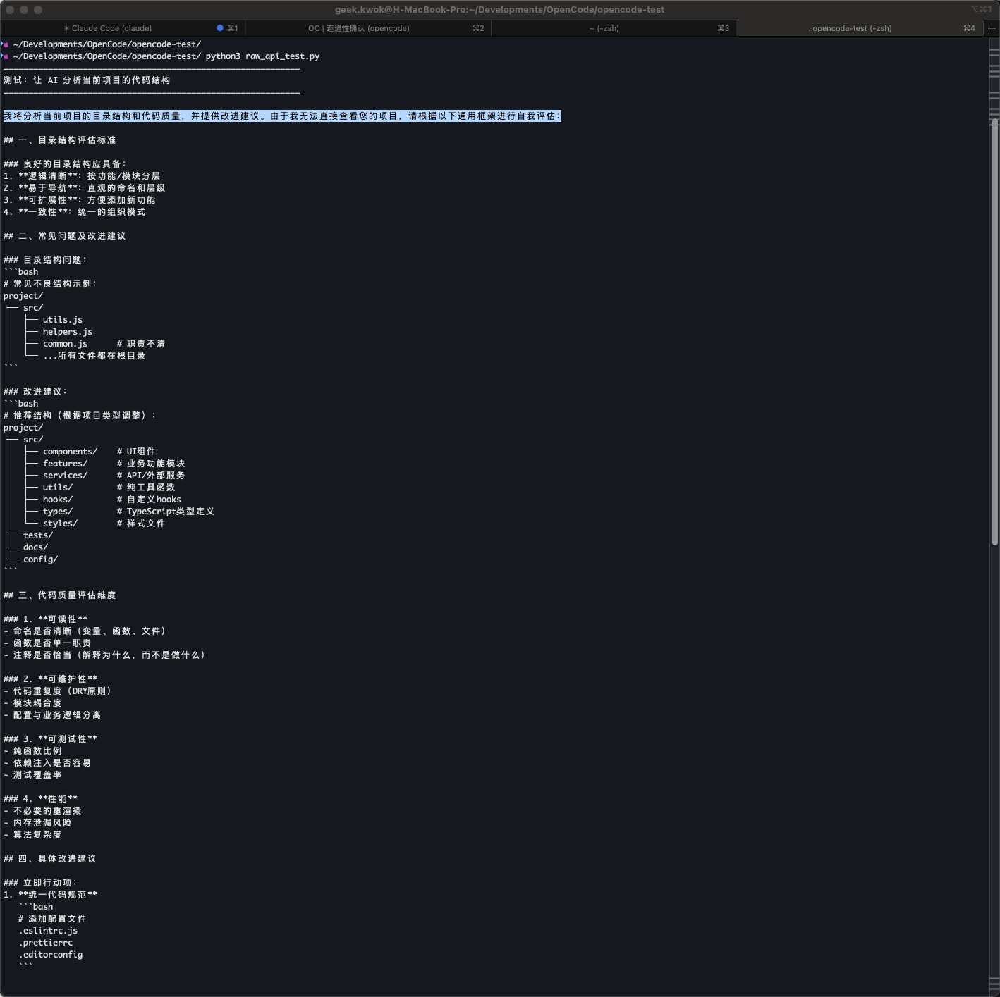
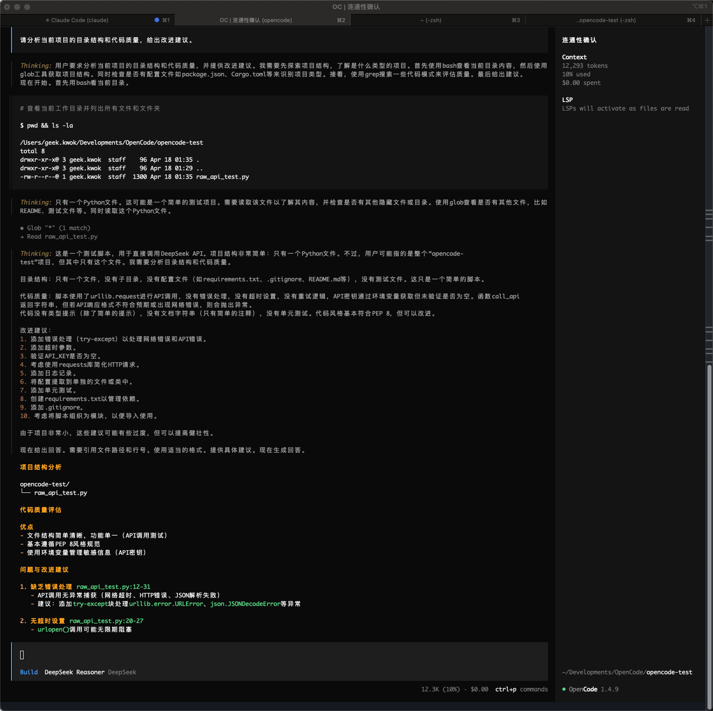
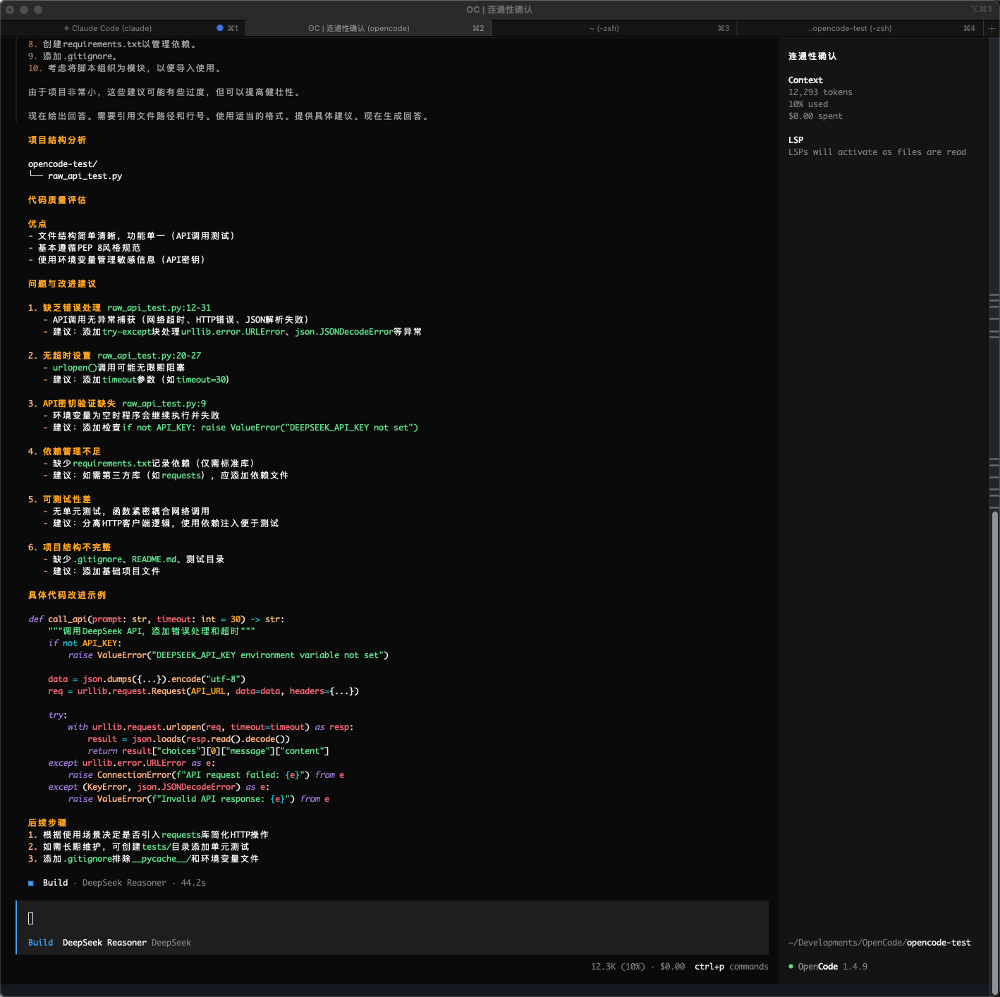

# 裸 API 调用与 OpenCode 编排对比实验感受

## 一、裸 API 调用

在裸 API 调用场景下，提交的上下文仅包含一句提示词：

> 请分析当前项目的目录结构和代码质量，给出改进建议。

除此之外，没有任何关于本地项目的额外信息。当前工作目录下的文件结构、代码内容等均未被包含在请求上下文中。云端部署的大模型完全无法感知本地的实际项目状态。它虽然具备强大的推理与知识储备能力，却没有任何执行层面的“手脚”，因而只能给出抽象的理论指导，而无法执行任何具体的操作。

因此，当我们仅以这一句话作为输入调用 API 时，模型虽然能够正确理解用户意图，但实际上既无法读取目录结构，更无法获取源代码文件进行实质性分析。

其返回结果通常是通用性的回应框架，例如：

> 我将分析当前项目的目录结构和代码质量，并提供改进建议。由于我无法直接查看您的项目，请根据以下通用框架进行自我评估。

随后提供的是一系列宽泛的指导原则，而非针对具体项目的操作。

具体实验结果展示如下：

### 小结

裸 API 调用的流程可概括为：

> 提交提示词 → LLM 推理并输出通用指导思想 → 结束

由于缺乏真实的项目上下文，模型只能给出高度抽象的通用建议。体验上给人的感觉是：大脑极为发达，能说会道；但因缺少“手脚”与感知能力，无法真正动手解决实际问题。

## 二、OpenCode 编排

在 OpenCode 环境中，使用完全相同的提示词：

> 请分析当前项目的目录结构和代码质量，给出改进建议。

首先，界面中可见 `Thinking` 提示信息，内容大致为：

> 用户要求分析当前项目的目录结构和代码质量，并提供改进建议。我需要先探索项目结构，了解是什么类型的项目。首先使用 bash 查看当前目录内容，然后使用 glob 工具获取项目结构。同时检查是否有配置文件如 `package.json`、`Cargo.toml` 等来识别项目类型。接着，使用 grep 搜索一些代码模式来评估质量。最后给出建议。现在开始。首先用 bash 看当前目录。

由此可以推断：OpenCode 首先将提示词提交给大语言模型（LLM），模型返回**指导思想和行动建议**，随后 OpenCode 将该建议解析为具体的执行步骤。

- **指导思想**：探索项目结构 → 阅读代码 → 给出针对性建议
- **行动建议**：
  1. 使用 `bash` 查看当前目录内容
  2. 使用 `glob` 获取项目结构
  3. 检查配置文件以识别项目类型
  4. 使用 `grep` 搜索代码模式
  5. 汇总分析并给出建议

随后，OpenCode 依照上述步骤依次执行具体操作：

1. **查看当前工作目录并列出文件**  
   在这一步中，OpenCode 调用 `bash` 工具执行目录列表命令，并将返回结果再次提交给 LLM。模型据此推断：“只有一个 Python 文件。这可能是一个简单的测试项目。需要读取该文件以了解其内容，并检查是否有其他隐藏文件或目录。使用 glob 查看是否有其他文件，比如 README、测试文件等。同时读取这个 Python 文件。”

2. **执行具体工具命令**  
   根据 LLM 的指示，OpenCode 执行了以下操作并在界面中显示：

> ✱ Glob "*" (1 match)
> → Read raw_api_test.py

3. **获得基于实际代码的分析结果**  
OpenCode 将 `glob` 结果及 `raw_api_test.py` 的代码内容一并提交给 LLM。模型基于真实的上下文进行了深入理解，并输出了一份具体的分析报告，内容包括项目结构梳理、代码质量评估（指出优点与具体问题）以及附带行号引用的改进建议示例。

此外，界面中展示的 `Thinking` 内容也体现了 LLM 的**思维链推理过程**：模型判断这是一个仅含单一脚本的极简项目，并针对其健壮性、错误处理、依赖管理等方面提出了可落地的修改建议。

具体实验结果展示如下：

### 小结

OpenCode 调用的流程可概括为一个**循环反馈机制**：

> 提交上下文 → LLM 推理并规划行动 → OpenCode 执行具体命令 → 捕获结果并再次提交 → 循环迭代直至任务完成

在这一模式下，OpenCode 充当“手脚”负责环境交互与数据获取，LLM 则作为“大脑”负责理解、推理与决策。两者紧密配合，最终能够基于实际项目代码完成具体、可操作的改进分析。
