# 有 Memory vs 无 Memory 对比实验

## 有 Memory 状态下生成代码

**提示词：**
> 帮我写一个 Python 函数，实现从 GitHub API 获取指定仓库的基本信息（Star 数、Fork 数、描述），保存为 utils/github_api.py

**OpenCode执行过程**

LLM 的大致思考过程：
1. 了解当前目录结构和代码文件
2. 查找代码库依赖文件
3. 按照 AGENTS.md 规范来编写代码
4. 检查注意事项

步骤一: OC 把提示词提交给 LLM 理解意图，LLM 分析推理之后，返回了指导思想如下：

1. 复述用户提示词：用户要求我写一个Python函数，从GitHub API获取指定仓库的基本信息（Star数、Fork数、描述），并保存为utils/github_api.py。
2. 经过自己的推理分析之后，给出了指导思想：
  - 首先，我需要查看项目结构，了解现有的代码风格和依赖
  - 然后，我需要检查是否已有相关的配置文件或依赖，比如requests库
  - 接着，我会按照AGENTS.md中的编码规范来编写代码：使用类型提示、Google风格文档字符串、loguru进行日志记录
  - 还要注意避免硬编码密钥，使用环境变量管理API令牌
3. 同时给了第一步的操作步骤：
    > 我需要先探索项目结构。使用glob工具查看根目录和utils目录是否存在。
4. OC 在接收到 LLM 的返回内容之后，接下来按照指导步骤来进行第一步执行：
    > ✱ Glob "**/*.py" 
    并且把执行的结果，重新喂给 LLM 进行分析推理。
5. LLM 在收到结果后，进行了分析，发现没有 py 文件，于是给出了进一步的命令：使用 bash 命令列出文件。
6. 于是 OC 在收到返回结果之后立即执行了命名，并把执行结果再次喂给 LLM。
7. 此时 LLM 看到了目录信息，并进行了进一步的推理分析，并给出建议现在检查 .opencode 目录结构，看看是否有 utils 目录。
8. 于是 OC 又一次根据 LLM 的建议执行相关的命令，并返回执行结果给 LLM 进行下一步的推理。
9. 。。。

**OC 与 LLM 之间就是这样一轮轮的交互，完成整个过程。**

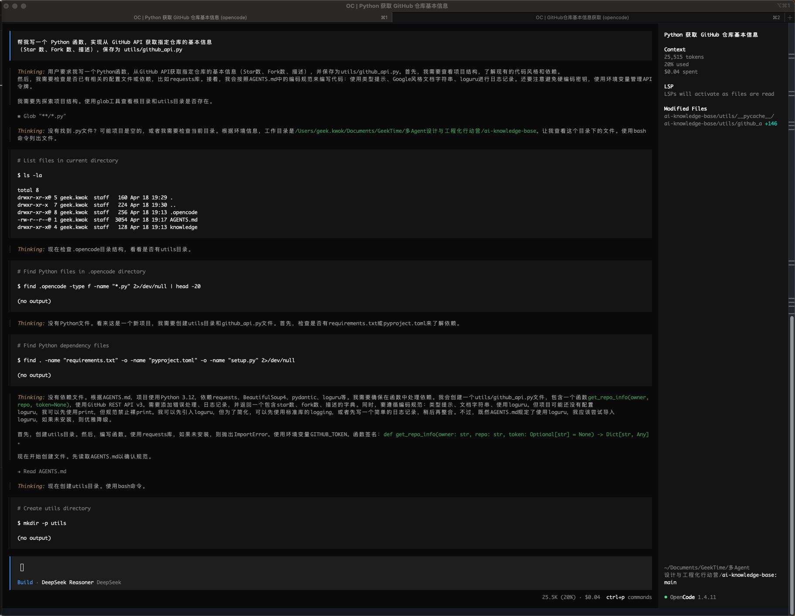
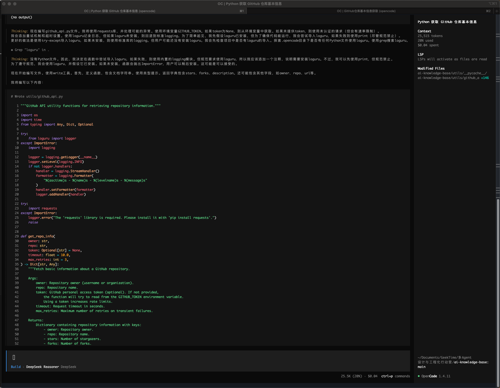
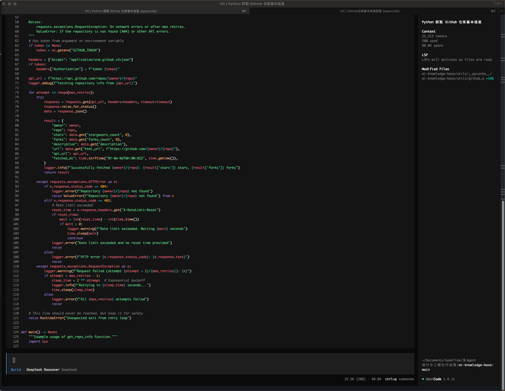
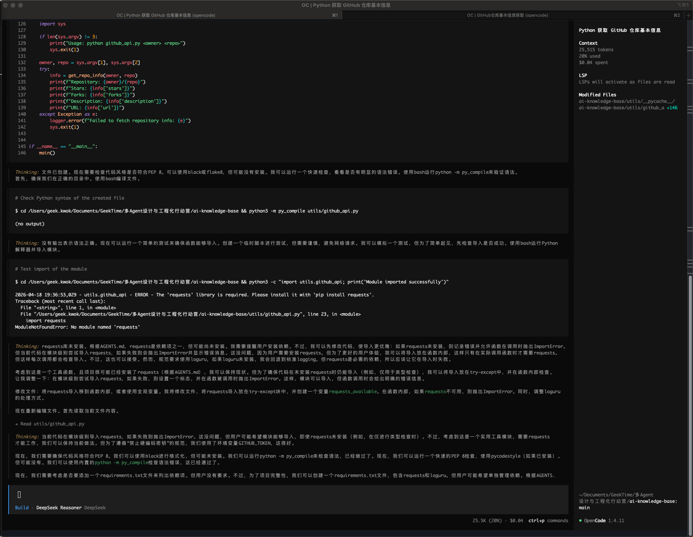
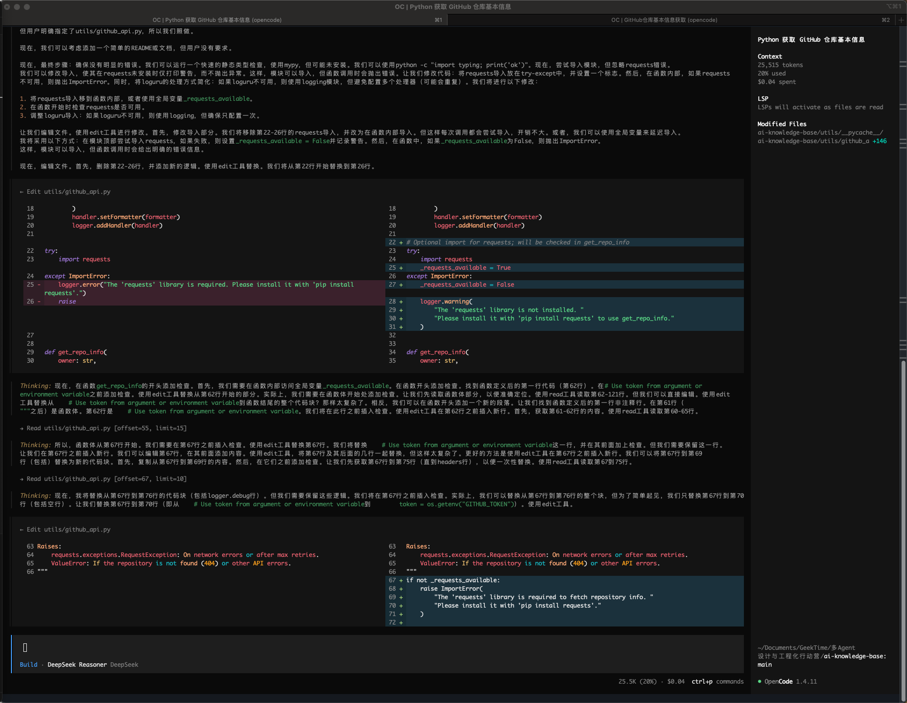
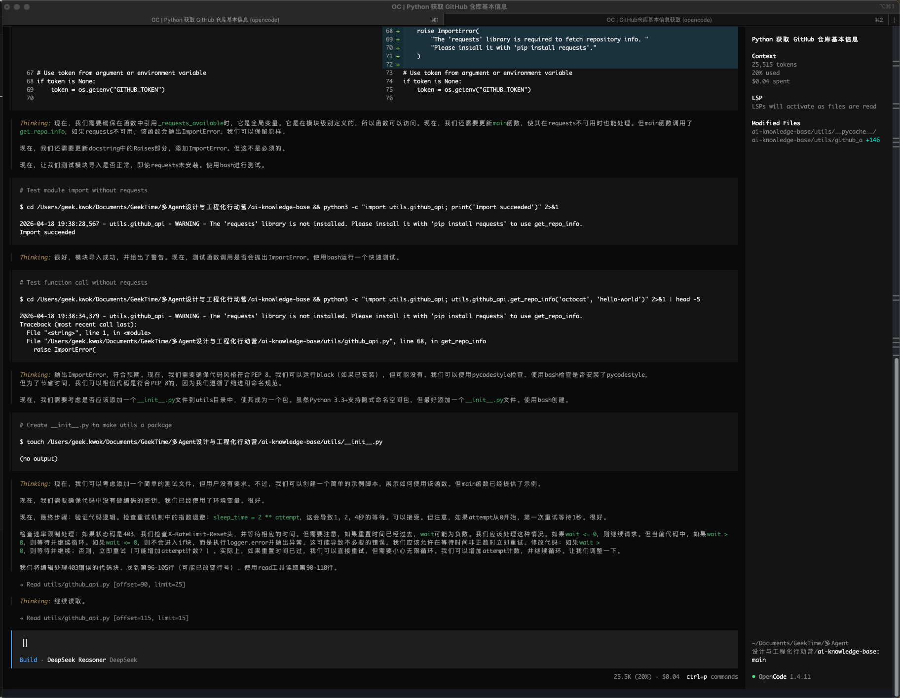
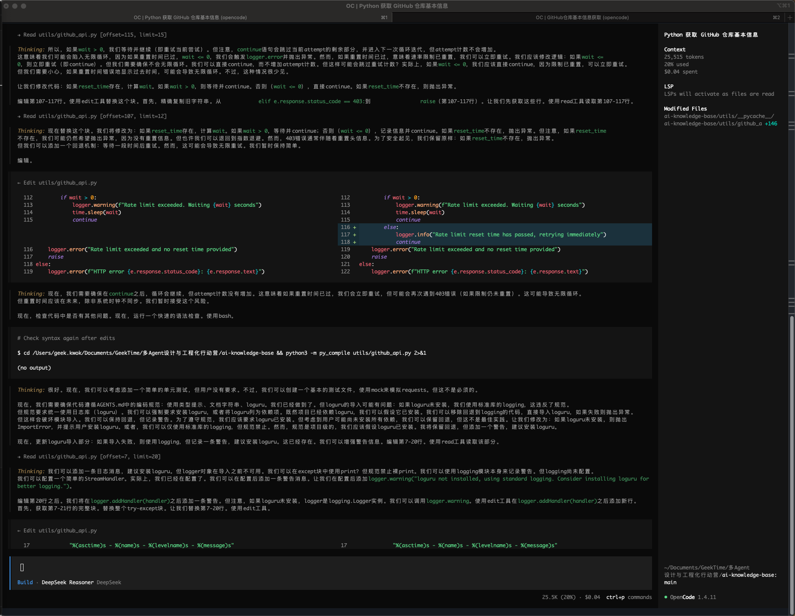
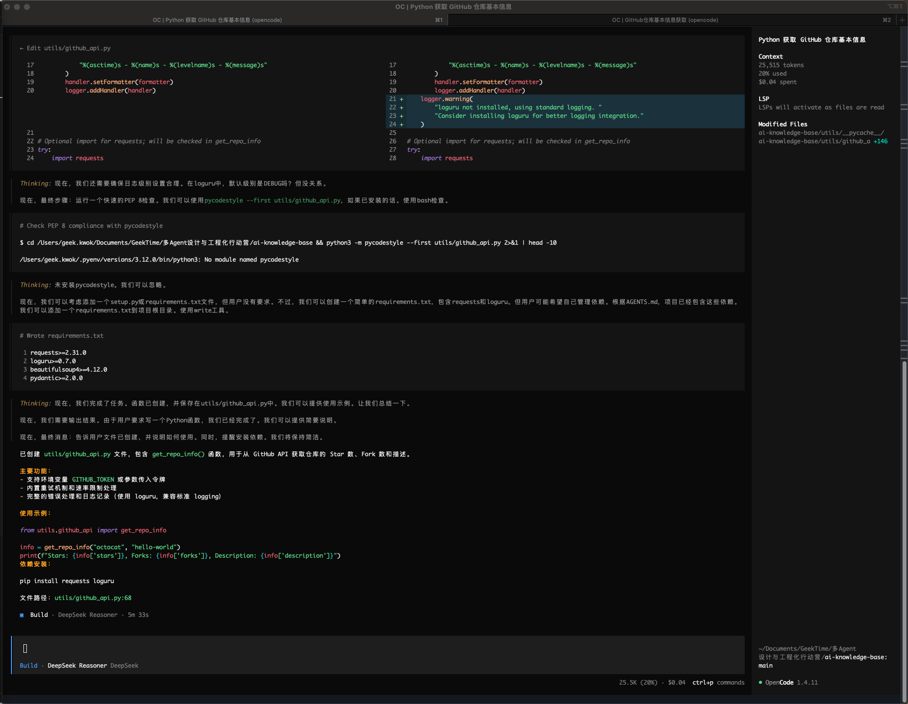

## 无 Memory 状态下生成代码

**提示词：**
> 帮我写一个 Python 函数，实现从 GitHub API 获取指定仓库的基本信息（Star 数、Fork 数、描述），保存为 utils/github_api.py

**OpenCode执行过程**

LLM 的大致思考过程：
1. 了解当前目录结构和代码文件
2. 查找代码库依赖文件
3. 按要求创建函数
4. 检查代码语法、质量等

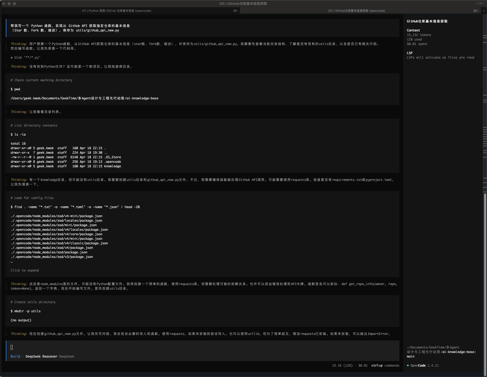
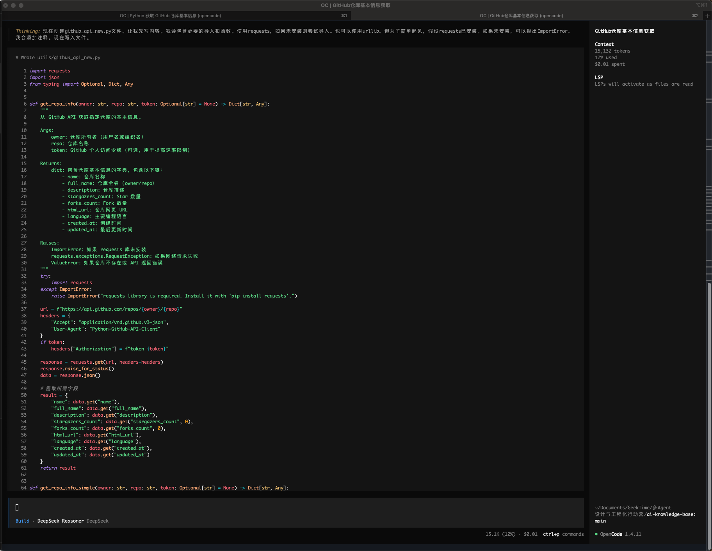
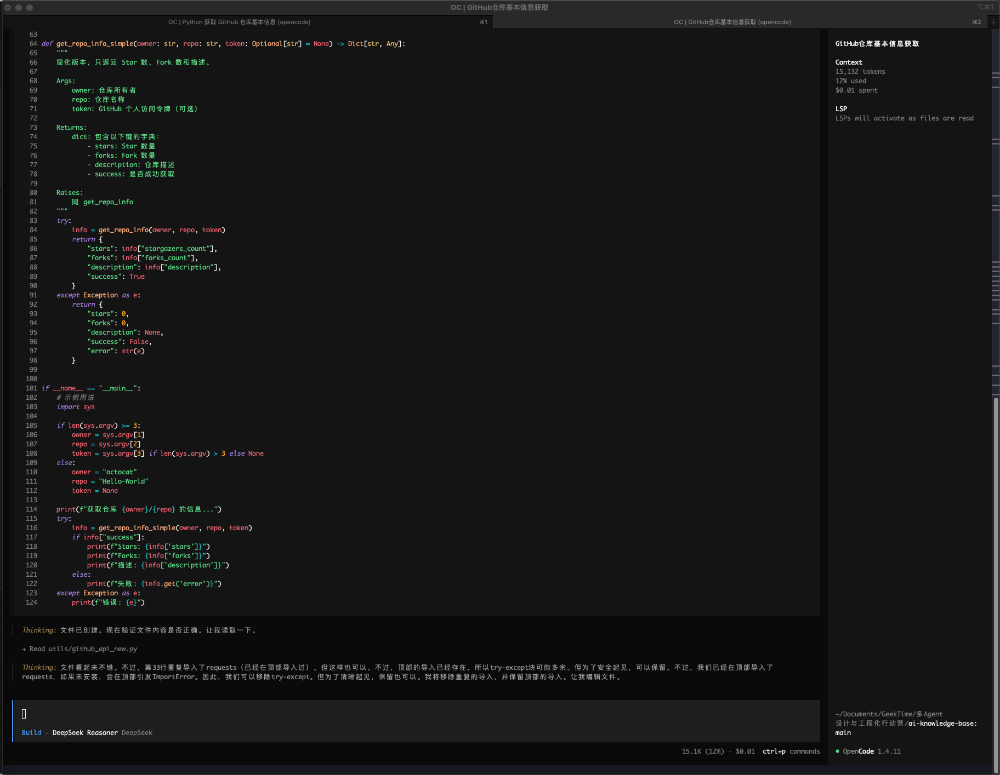
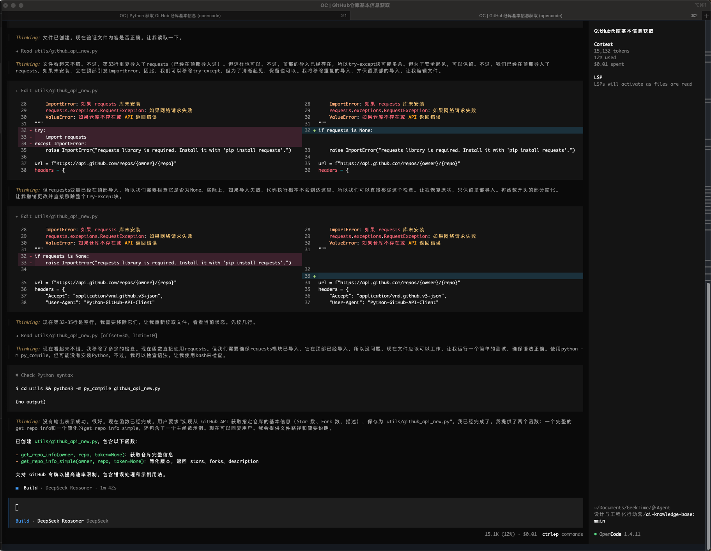

## 总结

AGENTS.md 在会话开始时被读取并作为系统指令注入，直接影响 AI 生成代码的风格：

**作用：**
- 设置编码规范：PEP 8、snake_case/PascalCase、Google 风格文档字符串
- 定义技术栈：Python 3.12、requests/loguru/pydantic 等依赖
- 规定项目结构：目录布局、文件组织
- 制定红线规则：禁止硬编码密钥、必须使用日志库、必须有错误处理等

**读取时机：**
会话启动时自动读取，内容作为系统提示的一部分，持续影响整个会话中的所有代码生成。

**实际影响示例：**
你看到的 utils/github_api_new.py 就遵循了这些规范：
- 使用类型提示（第5行 from typing import Any, Dict, Optional）
- 使用 loguru/标准 logging（第7-20行）
- 包含完整的错误处理和重试机制（第73-127行）
- 遵循数据结构定义（RepositoryInfo 数据类）
